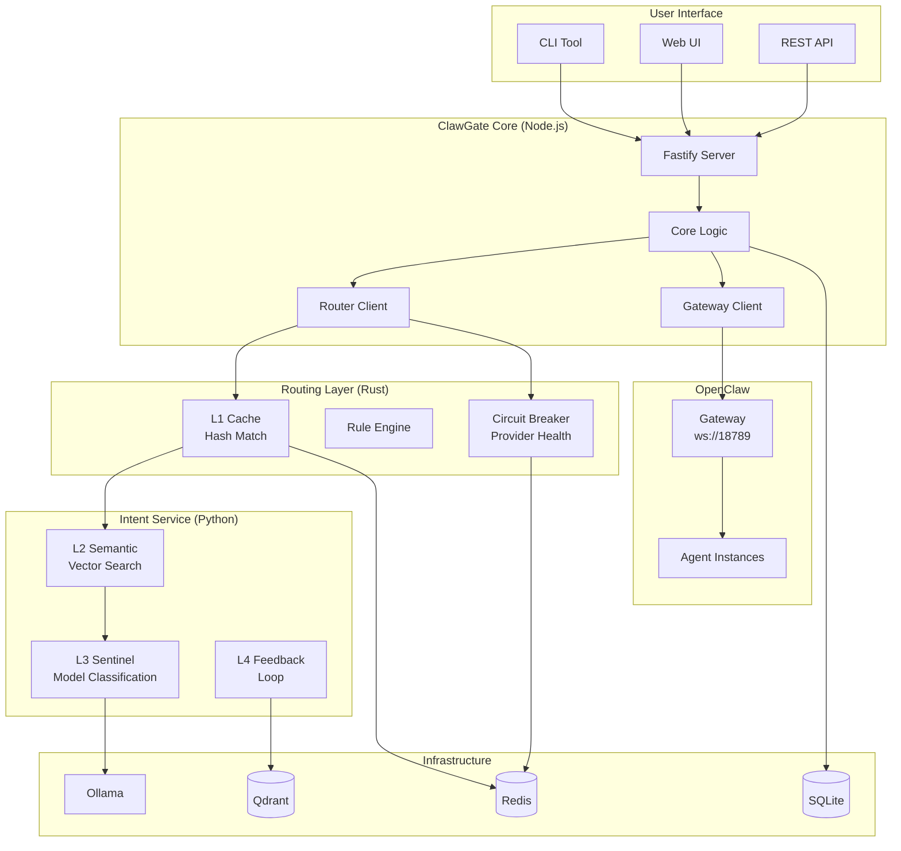
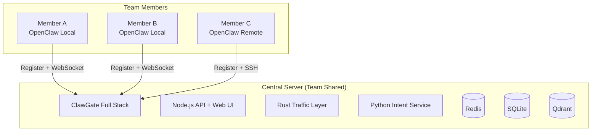

# ClawGate Architecture

> **System Architecture and Design Decisions**

This document provides a comprehensive overview of ClawGate's architecture, including system design, module interactions, and technical rationale.

---

## 1. System Overview

ClawGate is a **resource scheduling platform** for OpenClaw, designed with three core capabilities:

1. **Multi-Agent Management** — Monitor and control multiple OpenClaw Agent instances
2. **Intelligent Routing** — Automatically select optimal models based on task complexity
3. **Workflow Orchestration** — DAG-based task scheduling with multiple trigger types

---

## 2. High-Level Architecture



---

## 3. Three-Language Architecture

ClawGate uses a **polyglot architecture** with clear separation of concerns:

| Language | Responsibility | Rationale |
|----------|---------------|-----------|
| **Node.js (TypeScript)** | OpenClaw integration, API server, Web UI, L4 feedback collection | Native OpenClaw SDK support, zero integration friction |
| **Rust** | Traffic forwarding, L1 cache, rule engine, circuit breaker | Zero-cost abstractions, low latency, high throughput |
| **Python** | Embedding generation, vector search, L3 model, L4 vector writes | Unmatched ML/vector ecosystem (sentence-transformers, Qdrant) |

**Inter-Process Communication**: HTTP REST (development) / gRPC + Protobuf (production)

---

## 4. Intelligent Routing Engine (4-Layer)

The routing engine is the **core innovation** of ClawGate, designed to minimize latency while maximizing accuracy.

### 4.1 Layer Architecture

```
User Input
    │
    ▼
┌─────────────────────────────────────────────┐
│  L1: Exact Match Cache (Rust, <1ms)         │
│  Normalize → SHA-256 → Redis (TTL 1h)       │
│  Hit → Return cached decision                │
└──────────────┬──────────────────────────────┘
               │ Miss
               ▼
┌─────────────────────────────────────────────┐
│  L2: Semantic Search (Python, 10-30ms)      │
│  Ollama Embedding → Qdrant Top-3            │
│  Similarity ≥ 0.75 → Majority vote           │
└──────────────┬──────────────┬───────────────┘
               │ High Conf    │ Low Conf
               ▼              ▼
         Route Decision  ┌──────────────────┐
                         │  L3: Sentinel     │
                         │  Ollama qwen2.5:3b│
                         │  Few-Shot (5s)    │
                         └──────┬────────────┘
                                │
                ┌───────────────┘
                ▼
      [Execute → Call Model]
                │
                ▼
┌─────────────────────────────────────────────┐
│  L4: Feedback Loop (Async)                  │
│  User switches model → Write to vector DB   │
│  3x negative feedback → Trigger downgrade   │
└─────────────────────────────────────────────┘
```

### 4.2 Performance Targets

| Layer | Implementation | Target Latency | Coverage |
|-------|---------------|----------------|----------|
| L1 | Rust + Redis | <1ms | ~30% (repeated queries) |
| L2 | Python + Qdrant | 10-30ms | ~55% (semantic match) |
| L3 | Python + Ollama | 200-500ms | ~15% (novel queries) |
| L4 | Async | Non-blocking | 100% (background) |

### 4.3 Key Optimizations

1. **L2 Non-Blocking Embedding**: `asyncio.run_in_executor()` prevents event loop blocking
2. **L1 Normalization**: Lowercase + trim + punctuation removal for higher hit rate
3. **L4 3x Verification**: Prevents accidental feedback pollution

---

## 5. Data Storage Strategy

ClawGate uses a **hot/cold data separation** strategy:

### 5.1 Redis (Hot Data, High-Frequency Writes)

```
routing_cache       TTL 1h      L1 hash cache
session_state       TTL 24h     Active session state
instance_health     TTL 10s     Agent heartbeat
costs_realtime      Real-time   Token usage accumulation
feedback_queue      Buffer      Pending feedback writes
routing_logs_buf    Rolling     Last 1000 routing decisions
```

### 5.2 SQLite (Cold Data, Low-Frequency Writes)

```
agents              Agent metadata
sessions            Session history snapshots
dags                DAG definitions
dag_runs            Execution history
costs               Daily aggregated costs
routing_logs        Archived routing decisions
feedback_signals    User feedback records
```

### 5.3 Sync Mechanism

- **Scheduled Archive**: BullMQ job every 5 minutes (costs) / 10 minutes (logs)
- **Atomic Guarantee**: Redis `MULTI/EXEC` + SQLite transaction rollback
- **Failure Recovery**: `sync_checkpoint` for crash recovery

---

## 6. OpenAI-Compatible API Layer

ClawGate exposes a fully OpenAI-compatible endpoint at `POST /v1/chat/completions`, enabling zero-config integration with tools like Cursor, LobeChat, and OpenWebUI.

### 6.1 Request Flow

```
POST /v1/chat/completions
    │
    ▼
lastUserMessage(messages)     ← extract routing signal
    │
    ▼
RouterClient.route(prompt)    ← L1 → L2 → L3 decision
    │
    ▼
dispatchProvider(model)
    ├── claude-*  → Anthropic SDK (singleton client)
    ├── gpt-*     → OpenAI SDK (singleton client)
    └── other     → Ollama HTTP API
    │
    ▼
OpenAI-format response        ← id / object / model / choices / usage
    │
    ▼ (async, non-blocking)
pushRoutingLog()              ← Redis routing_logs_buf
```

### 6.2 Error Handling

| Scenario | HTTP | Trigger |
|----------|------|---------|
| No user message in `messages` | 400 | `lastUserMessage()` returns `""` |
| API key not configured | 400 | `ConfigError` thrown in Provider |
| Provider call failed | 502 | Network / model error |

### 6.3 Known Limitations / Status (v0.5)

| Issue | Status | Details |
|-------|--------|---------|
| **Issue 1** | ✅ Fixed | `connectRedis()` now called at startup. Routing logs write successfully. |
| **Issue 5** | 🔜 Deferred | Qdrant healthcheck reports `unhealthy` due to missing `curl` in image. Does not affect functionality. |
| **Issue 6** | 🔜 Deferred | Gateway device authentication (challenge-response) not implemented. DAG e2e tests use Mock Gateway. |
| **L2/L3 validation** | ✅ Validated | Four-layer routing fully validated (2026-04-16). L1 <1ms, L2 ~40ms, L3 <100ms (hybrid strategy). |
| **L4 feedback API** | ✅ Implemented | `POST /api/route/feedback` Node.js endpoint + Python feedback loop. |

---

## 7. OpenClaw Integration

ClawGate integrates with OpenClaw via two channels:

### 6.1 File System

```
~/.openclaw/
├── openclaw.json       → Gateway token, port, default model
├── agents/             → Agent discovery
└── identity/           → Device Ed25519 key
```

### 6.2 WebSocket Gateway

```
ws://127.0.0.1:18789
├── sessions.list / create / abort / send
├── agents.list / create / update
├── cron.add / list / remove
└── onEvent (real-time events)
      ├── session.start
      ├── session.end
      ├── session.message
      └── session.failed
```

---

## 7. Technology Stack

### 7.1 Frontend

- **Framework**: React 18 + TypeScript + Vite
- **UI Components**: shadcn/ui + Tailwind CSS
- **State Management**: Zustand
- **Data Fetching**: TanStack Query

### 7.2 Backend

- **API Server**: Node.js + Fastify
- **Database**: SQLite (better-sqlite3 + Drizzle ORM)
- **Task Queue**: BullMQ (Redis backend)
- **Routing Layer**: Rust (Axum + Tokio)

### 7.3 ML/Vector

- **Vector DB**: Qdrant (local Docker)
- **Embedding**: Ollama (nomic-embed-text / bge-m3)
- **Sentinel Model**: Ollama (qwen2.5:3b)
- **Python Service**: FastAPI + sentence-transformers

### 7.4 Infrastructure

- **Monorepo**: Turborepo + pnpm workspaces
- **Containerization**: Docker Compose

---

## 8. Security Considerations

1. **Token Storage**: OpenClaw Gateway token stored in `~/.openclaw/openclaw.json` (user-only read)
2. **API Authentication**: (To be implemented in v1.0)
3. **Input Validation**: Zod schema validation for all API inputs
4. **SQL Injection**: Drizzle ORM parameterized queries
5. **XSS Prevention**: React automatic escaping

---

## 9. Scalability

### 9.1 Current Limitations (v0.3)

- Single-machine deployment
- SQLite (not suitable for high concurrency)
- No horizontal scaling

### 9.2 Team Deployment Architecture (v1.0)

ClawGate adopts a **centralized server + distributed OpenClaw** model for team scenarios:



**Key mechanisms**:
- **Instance Registration API**: Each member's OpenClaw registers via HTTP, heartbeat keepalive
- **Multi-Instance Connection Pool**: ClawGate maintains multiple WebSocket connections to OpenClaw Gateways
- **Member Authentication**: JWT/API Key, role-based access (admin/member)
- **Shared Intelligence**: L2/L4 vector DB shared across all members, accelerating routing evolution
- **Centralized Cost Tracking**: Unified budget control and per-member usage breakdown

### 9.3 ClawGate Self-Update

- **Docker deployment (primary)**: Watchtower monitors image updates, auto pull + restart (seconds-level downtime)
- **Bare-metal deployment**: `clawgate self-update` CLI command, similar to `rustup update`

### 9.4 Future Enhancements (v1.0+)

- Multi-instance OpenClaw management
- PostgreSQL migration for high concurrency
- Distributed task queue (Redis Cluster)
- Load balancing for Rust routing layer

---

## 10. Design Decisions

### 10.1 Why Three Languages?

**Rationale**: Each language excels in its domain, and the overhead of inter-process communication is negligible compared to the benefits.

- **Node.js**: OpenClaw SDK is TypeScript-native
- **Rust**: L1 cache requires <1ms latency (impossible in Node.js)
- **Python**: ML ecosystem (sentence-transformers, Qdrant client) has no equivalent in other languages

### 10.2 Why SQLite?

**Rationale**: ClawGate targets **single-developer / small-team** scenarios where SQLite's simplicity outweighs PostgreSQL's complexity.

- Zero configuration (no separate DB server)
- WAL mode supports moderate concurrency
- Easy backup (single file)

**Trade-off**: Not suitable for >100 concurrent users (will migrate to PostgreSQL in v1.0 if needed)

### 10.3 Why Not gRPC in v0.3?

**Rationale**: HTTP REST is sufficient for current load, and gRPC adds complexity.

- Development velocity prioritized over performance
- gRPC migration planned for v1.0 (production-ready)

---

## 11. Testing Strategy

### 11.1 Unit Tests

- **Node.js**: vitest (packages/*)
- **Rust**: cargo test (services/router-rust)
- **Python**: pytest (services/intent-python)

### 11.2 Integration Tests

- **Routing Engine**: Mock Python service responses (wiremock)
- **Gateway Client**: Mock OpenClaw Gateway (WebSocket)

### 11.3 End-to-End Tests

- Docker Compose full stack
- Web UI automation (Playwright, planned for v0.5)

---

## 12. Monitoring & Observability

### 12.1 Current (v0.3)

- Routing stats (L1-L4 hit rates, latency)
- Token usage tracking
- Session event logs

### 12.2 Planned (v1.0)

- Prometheus metrics export
- Grafana dashboards
- Distributed tracing (OpenTelemetry)

---

## 13. References

- [CLAUDE.md](./CLAUDE.md) — Complete development plan and collaboration principles
- [OpenClaw Documentation](https://github.com/openclaw)
- [Qdrant Documentation](https://qdrant.tech/documentation/)
- [Ollama Documentation](https://ollama.ai/docs)

---

**Last Updated**: 2026-04-17
**Version**: v0.6 (Wave 4 done; v1.0 Phase 2 done, Phase 3 core done: health check scheduler + auto-offline + alerts + GatewayPool cleanup)
**Next**: v1.0 Phase 1 (Rust traffic layer) or Phase 4 (ecosystem) or Phase 5 (documentation)
