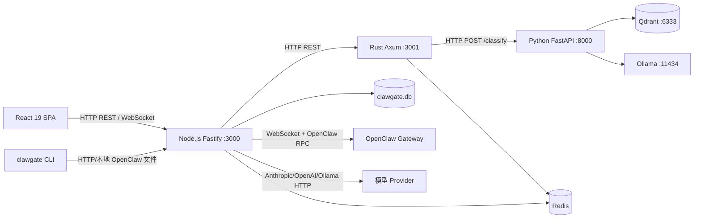

# ClawGate 架构现状

> 本文以当前源码、配置和 Compose 文件为事实源。它描述已经存在的边界与行为，不把设计稿、Proto 文件或未来路线图当作已交付能力。

## 1. 产品边界

ClawGate 是 OpenClaw 的基础设施增强层，当前实现集中在三个能力域：

| 能力域 | 当前实现 | 主要入口 |
| --- | --- | --- |
| 智能模型路由 | Rust L1 Redis 哈希缓存；Python L2 向量相似检索、L3 分类；Rust 规则 fallback；Node 调用模型 Provider | `POST /api/route`、`POST /v1/chat/completions` |
| Agent / Session 管理 | Node 维护 Gateway 连接池，转发 Agent、Session、事件和用量操作 | `/api/agents`、`/api/sessions`、`/ws/events` |
| DAG 工作流与实例调度 | React Flow 编辑器、SQLite 定义与运行状态、BullMQ Worker、Cron/Webhook/手动触发、GatewayPool 选择实例 | `/api/dags`、`/api/dag-runs`、`/api/instances` |

系统也提供团队、成员、健康、告警、统计和 OpenClaw 生命周期接口。当前版本仍是单机优先的可运行系统，不能按 v1.0 GA 或多租户生产平台描述。

## 2. 进程与模块边界


```mermaid
graph LR
  Browser[React 19 SPA] -->|HTTP REST / WebSocket| Server[Node.js Fastify :3000]
  CLI[clawgate CLI] -->|HTTP/本地 OpenClaw 文件| Server
  Server -->|HTTP REST| Router[Rust Axum :3001]
  Router -->|HTTP POST /classify| Intent[Python FastAPI :8000]
  Router --> Redis[(Redis)]
  Intent --> Qdrant[(Qdrant :6333)]
  Intent --> Ollama[Ollama :11434]
  Server --> Redis
  Server --> SQLite[(clawgate.db)]
  Server -->|WebSocket + OpenClaw RPC| Gateway[OpenClaw Gateway]
  Server -->|Anthropic/OpenAI/Ollama HTTP| Providers[模型 Provider]
```

### 2.1 Node.js 主服务（`packages/server` + `packages/core`）

- Fastify 监听 `0.0.0.0:3000`，注册 CORS、WebSocket 和静态 SPA。
- 启动时加载 `~/.openclaw/openclaw.json`、`clawgate.yaml`，初始化 SQLite、连接 Redis，创建 GatewayClient、BullMQ DAG 队列和实例健康检查任务。
- OpenClaw 默认是可选依赖：连接失败且 `CLAWGATE_REQUIRE_OPENCLAW` 非 `true` 时，服务继续提供路由和 OpenAI 兼容端点，但 Agent、Session、DAG 功能不可用。
- `packages/core` 负责配置、SQLite/Drizzle、Redis、GatewayPool、路由客户端、DAG 执行器和队列；`packages/server/src/routes` 负责 REST 面。
- OpenAI 兼容端点按模型前缀选择 Anthropic、OpenAI 或 Ollama，并把成本实时累计到 Redis。

### 2.2 Rust 路由服务（`services/router-rust`）

- Axum 监听 `0.0.0.0:3001`，端点为 `/health`、`/route`、`/stats`、`/circuit/status`、`/circuit/report`、`/circuit/reset/:provider`。
- 启动时创建 Redis L1 缓存；因此 Redis 是该进程的启动硬依赖。
- `/route` 先按 prompt 查询 Redis 哈希缓存；未命中时通过 HTTP 调 Python `/classify`。Python 超时或不可达时使用 Rust 规则判断复杂度并选择简单/复杂默认模型。
- 熔断状态保存在 Rust 进程内存，重启后丢失；统计计数器也不是持久化指标。

### 2.3 Python 意图服务（`services/intent-python`）

- FastAPI 监听 `0.0.0.0:8000`，提供 `/health`、`POST /classify`、`POST /feedback`、`GET /feedback/stats`。
- L2 使用 Ollama embedding 与 Qdrant；未命中后进入 L3“规则 → 可选 LR → 保守策略”，并将非超时结果写回 Qdrant。当前 L3 不调用生成式 Ollama 分类模型。
- L4 `L4FeedbackLoop` 当前在进程内存中按模型累计反馈，负反馈达到阈值时建议降级模型并更新 L2；重启会丢失反馈状态。
- 仓库没有 Python pytest 回归文件；`l3_sentinel/lr_classifier.py` 仍引用已移除的 `sklearn.externals.joblib`，且仓库没有训练模型文件，LR 路径不能视为可用生产实现。

### 2.4 Web 与 CLI

- Web 是 React 19 + Vite 6 + Tailwind 4，使用 Zustand、TanStack Query、React Flow、Recharts；没有 shadcn/ui 运行时依赖。
- CLI 目前提供 `init`、`status`、`agents`、`sessions`、`openclaw` 命令，构建后通过 HTTP API 或本地 OpenClaw 配置工作；不存在文档中曾描述的 `start/router/dag` 命令。

## 3. 进程间协议与启动流

当前跨进程调用全部是 HTTP REST/JSON：Node -> Rust、Rust -> Python。`proto/router.proto` 和 `proto/intent.proto` 仅是未接入的设计文件，不能写成生产 gRPC 契约。

Node 启动顺序为：

1. 读取 OpenClaw 配置和 YAML；必要时生成默认 `clawgate.yaml`。
2. 初始化 SQLite（固定项目根目录 `clawgate.db`，WAL + foreign keys）并执行内置迁移。
3. 连接 Redis，创建 GatewayClient 并尝试 WebSocket 握手；失败时按可选/强制模式处理。
4. 初始化 BullMQ DAG 队列、DAG Worker 和实例健康检查。
5. 扫描并恢复 Cron DAG，清理 Redis 中不存在于 SQLite 的孤儿 scheduler，然后监听 REST、WebSocket 和静态前端。

Redis 虽有部分业务操作的降级捕获，但主服务启动会调用 `connectRedis()`，BullMQ 也直接依赖 Redis；部署上应视 Redis 为硬依赖。Qdrant/Ollama 是 Python 路由能力的运行依赖，Python 启动时可在 Qdrant 不可达时继续启动，但 L2/L3 实际请求会降级或失败。

## 4. 智能路由数据流

```text
请求 prompt
  -> Node RouterClient（HTTP /route）
  -> Rust L1：SHA-256/规范化后的 Redis 缓存
       命中：返回 L1
       未命中：HTTP /classify -> Python
          L2：embedding + Qdrant 相似检索
          L3：规则 -> 可选 LR -> 保守策略；结果写回 Qdrant
       Python 不可用：Rust 规则 fallback
  -> Node 选择 Anthropic/OpenAI/Ollama Provider
  -> 异步写入 routing_logs_buf，并累计 costs_realtime
```

Node 的 `POST /api/route` 只返回路由决策；`POST /v1/chat/completions` 才执行实际模型调用并返回 OpenAI 风格响应。Provider API Key 缺失时对应外部 Provider 失败；预算检查依赖 Redis，Redis 异常时会放行请求。

## 5. API 面

Node REST 主要分组如下（统一前缀为 `/api`，除 OpenAI 与 WebSocket 外）：

- 健康与观测：`/health`、`/health/overview`、`/health/trends`、`/stats/overview`、`/alerts`。
- 路由与反馈：`/route`、`/route/stats`、`/route/feedback`、`/route/feedback/stats`。
- OpenAI 兼容：`POST /v1/chat/completions`。
- Agent/Session：`/agents`、`/sessions` 及用量记录。
- DAG（HEAD）：`/dags` CRUD、`/dags/:id/run`、Webhook 触发、`/dag-runs/:runId`。`/dags/:id/export` 与 `/dags/import` 仅存在于当前未提交工作区 F1。
- 团队与实例：`/teams`、`/members`、`/instances/register`、心跳、实例查询/负载/删除。
- OpenClaw 运维：`/openclaw/status`、版本检查、重启与升级 API；当前工作区 F2 的 Dashboard 仅展示命令建议。
- 实时事件：`GET /ws/events` WebSocket；Server 尝试桥接四类 Session 事件，但当前事件名/payload 与 OpenClaw 2026.4.14 不兼容。

团队认证使用 `X-API-Key` 查找 `members.api_key`；没有该头时多数业务路径按个人模式 `teamId=local` 处理。认证不是全局 Fastify hook，部分团队/查询接口仍可被未认证请求访问，团队隔离和 API Key 轮换不能视为完成。

## 6. 存储职责

### SQLite（`clawgate.db`）

结构化持久层包含 agents、sessions、costs、routing_logs、dags、dag_runs、dag_node_states、teams、members、instances、alerts。SQLite 使用 WAL；DAG 定义和每次运行/节点状态写入 SQLite。

当前迁移存在一个已复现缺口：干净数据库的 `CREATE TABLE dags` SQL 没有 `cron_timezone`，而 `cron_timezone` 只在检测到既有 `dags` 表时通过 `ALTER TABLE` 添加。临时空库在首次完整查询 `dags` 时返回 `no such column: cron_timezone`。

### Redis

- 路由 L1 缓存（TTL 默认 1 小时）。
- Session 状态（TTL 24 小时）；实例负载快照由实例心跳写入独立 Hash，TTL 20 秒。Core 中还定义了 10 秒 `instanceHealth` TTL，但当前实例路由不使用该键。
- `costs_realtime:<date>` 实时 token/USD 累计。
- `routing_logs_buf` 最近 1000 条路由日志。
- BullMQ DAG 队列和 Cron JobScheduler。
- DAG 节点可选缓存（由节点 `cacheTtl` 控制）。

### Qdrant / Ollama

Qdrant 保存 L2 语义样本；Ollama 提供 embedding，并可作为 Node 的本地 Chat Provider。L3 当前使用规则、可选 LR 和保守策略；Compose 仍预拉取 `qwen2.5:3b`，但 Python L3 不调用它做生成式分类。模型文件不由 Git 管理。

### 归档与一致性边界

当前未实现 Redis -> SQLite 的定时归档 Worker，也没有可证明的 `MULTI/EXEC + SQLite transaction` 原子跨存储提交。`sync_checkpoint` 只是预留键，不能作为已启用的恢复机制；Redis 热数据丢失不会自动补齐 SQLite 历史。

## 7. DAG 执行模型

支持 `manual`、`cron`、`webhook` 三种触发器。Cron 使用 BullMQ v5 `JobScheduler`，启动时按 SQLite DAG 恢复并清理孤儿 scheduler；Webhook body 可通过 `{{webhookPayload.*}}` 注入节点 prompt。

执行状态机为：

```text
pending -> running -> completed
                  \-> failed
pending ----------> skipped
```

Worker 对 DAG 做拓扑排序并按批次执行：condition 节点先求值，delay 节点等待，agent 节点计划通过 Gateway 创建独立 Session、发送消息、订阅事件并在结束后 abort 清理。无依赖的同批 agent 节点可并行执行，默认最大并发 5；节点 `cacheTtl > 0` 时启用 Redis 缓存。拓扑错误、节点异常会把运行标记为 failed，后续批次标记 skipped；DAG 执行不自动重试（BullMQ attempts=1）。

当前 Agent 节点真实执行被 Gateway 契约阻塞：Adapter 按 `result` 解响应、发送 `{content}` 并等待 `session.end`，而审计的 OpenClaw 2026.4.14 使用 `payload`、要求 `{message}` 且没有该结束事件；监听器又在发送返回后注册，存在首帧竞态。Core 的 8 个 Gateway executor 测试通过 Mock listener 绕过了这些帧解析问题。

## 8. 部署拓扑

仓库提供三份 Compose：

- `docker-compose.yml`：从源码构建 router、intent、server，外加 Redis、Qdrant、Ollama。
- `docker-compose.prod.yml`：拉取三个 GHCR 镜像，Redis/Qdrant/Ollama 与 Ollama 预热容器。
- `docker-compose.team.yml`：中央 Node/Rust/Python 服务，成员通过 HTTP 注册远程 OpenClaw 实例，不挂载中央机的 `~/.openclaw`。

默认端口为 Node `3000`、Rust `3001`、Python `8000`、Redis `6379`、Qdrant `6333/6334`、Ollama `11434`。发布镜像 Compose 的 Node 容器通过 `${HOME}/.openclaw` 只读挂载连接主机 Gateway；其中 `GATEWAY_URL` 当前不被 Server 读取。团队 Compose 传递的 `ADMIN_API_KEY` 也不被 Server 读取，lifecycle 路由实际读取 `CLAWGATE_ADMIN_TOKEN`。`.env.example` 现已明确标记这些未接入变量。

Dockerfile/Compose 仍存在路径和环境变量耦合：server 镜像需要把 Web `dist` 放到 `WEB_DIST` 指向的位置，裸机默认路径与容器路径不同；未完整配置 Gateway、Provider Key、Redis/Router/Intent URL 时，服务可能以降级模式启动但功能不完整。

## 9. 当前验证状态

- 5 个 TypeScript workspace 包具备构建脚本；只有 Core 有实际 Vitest 文件，Server/Shared/Web 的空测试任务会让根 `pnpm test` 失败，CLI 没有 test 任务；Rust 有 `cargo test`。
- Python 没有 pytest 测试文件；现有验证脚本不少是源码字符串匹配，不能等价于端到端回归。
- DAG 拓扑、缓存键、执行器和 Gateway executor 有单元/集成测试；真实 OpenClaw Gateway 业务协议仍未完成兼容验证，部分测试使用 Mock Gateway。
- 当前工作区正在进行 F1（DAG 导入/导出）、F2（OpenClaw 状态/版本与运维建议）、F3（实时事件面板）开发；这些变更尚未完成回归，不能写入已验证完成项。

## 10. 已知限制与风险

1. OpenClaw Gateway 的握手虽实现 token/challenge 分支，但业务 RPC/事件契约已确认不兼容本机 OpenClaw 2026.4.14；Agent、Session、DAG Agent 节点目前明确阻塞。
2. 团队 API Key 明文存储且无轮换；认证未全局覆盖，个人模式默认免认证，跨团队查询面仍需审计。
3. Gateway Token 及实例 Gateway Token 以配置/SQLite 明文保存。
4. WebSocket 客户端 URL 存在 `ws://` 硬编码，HTTPS 部署需要显式处理 `wss://`；Vite 开发代理也未覆盖 `/ws`。
5. DAG 编辑器保存时未持久化节点 `position`，前端 60 秒超时逻辑存在闭包状态风险；部分 F1/F2/F3 文案尚未完全国际化。
6. L4 反馈在内存中按模型聚合，重启丢失，不能称为“自动后台闭环”；LR 分类器依赖已移除的 sklearn 导入且无模型文件。
7. Rust 熔断和部分路由统计为进程内存状态；跨 Redis/SQLite 归档未启动且不具备原子性。
8. SQLite 适合单机/小规模并发，不提供水平扩展；Redis、Qdrant、Ollama 的单实例部署也没有高可用保证。

## 11. 相关文件

- Node 入口：`packages/server/src/index.ts`
- 核心模块：`packages/core/src/{router,gateway,dag,db,redis}`
- Rust 路由：`services/router-rust/src/main.rs`
- Python 意图：`services/intent-python/main.py`
- Compose：`docker-compose.yml`、`docker-compose.prod.yml`、`docker-compose.team.yml`
- 未接入协议草案：`proto/router.proto`、`proto/intent.proto`

**基线日期**：2026-07-29
